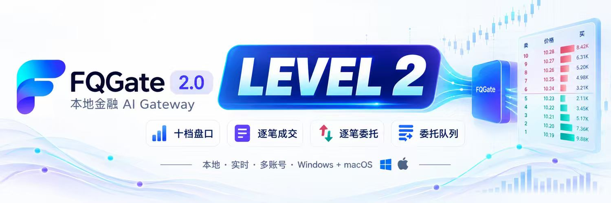

<p align="center">
  
</p>

<h1 align="center">FQGate Agent</h1>

<p align="center">
  面向多种 AI 工具的开源 FQGate 接入层<br>
  让 AI 安全、稳定地使用本机 A 股行情、K 线、资讯与 Level-2 数据
</p>

<p align="center">
  <a href="https://github.com/fqgate/FQGate-agent/actions/workflows/ci.yml"></a>
  <a href="https://github.com/fqgate/FQGate-agent/releases"></a>
  <a href="./LICENSE"></a>
  <a href="https://gitee.com/qicuo/tonghuasun-agent"></a>
</p>

<p align="center">
  
</p>

> FQGate 已启用专属 GitHub 组织 [fqgate](https://github.com/fqgate)。后续开源协作、正式发行和品牌建设均以该组织为长期入口。

FQGate Agent 是 FQGate 的开源 AI 接入项目，为 Codex、Claude Code、WorkBuddy、ZCode、OpenClaw、DeepSeek Harness、豆包和千问提供安装适配、技能、MCP Apps 界面及可选 SDK。

> Tonghuashun (THS) market data MCP integration for AI coding agents and assistants.

## 项目入口

| 项目 | 用途 | GitHub | 国内镜像 |
| --- | --- | --- | --- |
| FQGate Agent | 开源技能、宿主适配、安装器、MCP Apps 与 SDK | [fqgate/FQGate-agent](https://github.com/fqgate/FQGate-agent) | [Gitee](https://gitee.com/qicuo/tonghuasun-agent) |
| FQGate Releases | FQGate 官方安装包、稳定版清单与校验信息 | [fqgate/FQGate-releases](https://github.com/fqgate/FQGate-releases) | [Gitee](https://gitee.com/qicuo/fqgate-releases) |
| FQGate 组织 | 项目主页与后续开源项目 | [github.com/fqgate](https://github.com/fqgate) | — |

> **更名说明：** 原插件名为 `tonghuasun-agent`，现已更名为 `fqgate-agent`。原 GitHub 地址会继续重定向到组织仓库；Gitee 镜像暂时沿用原仓库名，以兼容旧用户、已有收藏和外部链接。

所有 AI 插件入口、安装适配、技能和界面组件均免费开源，不设订阅、会员、试用额度或付费解锁。FQGate 主程序作为本机行情网关单独提供编译包，并适用安装包内的许可；其主源码不在本仓库公开。

当前 Agent 插件版本为 `1.0.0`，要求 FQGate `0.1.0` 或更高版本。当前稳定版 FQGate 专注行情与资讯，不提供券商登录、账户查询、下单、撤单或资金划转接口；仓库中保留的 `trade-execution` 仅用于兼容仍提供相关接口的历史版本。

## 一句话安装

将下面这句话完整发送给你正在使用的 AI 助手：

```text
请按仓库说明安装并配置 FQGate Agent：https://gitee.com/qicuo/tonghuasun-agent.git。请先阅读根目录 README 和对应 AI 工具的安装说明，根据网络环境选择 FQGate 官方下载源，安装主程序与插件、创建桌面快捷方式、启动 FQGate，并确认名为 fqgate 的连接成功且能读取工具列表或完成健康检查；任何一步失败都请报告具体原因，不要把只下载或解压文件当作安装完成。
```

安装流程应完整覆盖：读取说明、选择匹配系统的正式版本、校验安装包、安装并启动 FQGate、配置当前 AI 工具、创建桌面快捷方式，以及验证 `fqgate` 连接。

## FQGate 主程序下载

- 国内下载：[Gitee FQGate 正式发行页](https://gitee.com/qicuo/fqgate-releases/releases)
- GitHub 下载：[FQGate Releases](https://github.com/fqgate/FQGate-releases/releases)
- 稳定版清单：[releases/stable.json](https://raw.githubusercontent.com/fqgate/FQGate-releases/main/releases/stable.json)

AI 安装时应先读取稳定版清单，再按操作系统和架构选择文件，并核对大小与 SHA-256。GitHub 正式包的下载地址格式为 `https://github.com/fqgate/FQGate-releases/releases/download/fqgate-v<version>/<fileName>`。

### Windows 自动安装

在已克隆的仓库根目录运行：

```powershell
powershell.exe -NoProfile -ExecutionPolicy Bypass -File .\installer\runtime\install-fqgate.ps1
```

脚本会选择当前正式版，下载并检查 FQGate，安装到当前用户的应用目录，创建一个桌面快捷方式，启动主程序并检查连接。若使用已经解压的 Agent 发行包，请按发行包内的目录结构选择相应安装脚本。

安装结束前，AI 应确认 FQGate 已经启动、名为 `fqgate` 的连接已经成功，并且能够读取工具列表或完成健康检查。如果连接尚未成功，应明确说明“插件文件已安装，但 FQGate 尚未连接”。

## 选择你的 AI 工具

| AI 工具 | 安装说明 |
| --- | --- |
| Codex | [AI-plugins/codex](./AI-plugins/codex/README.md) |
| Claude Code | [AI-plugins/claude-code](./AI-plugins/claude-code/README.md) |
| WorkBuddy | [AI-plugins/workbuddy](./AI-plugins/workbuddy/README.md) |
| ZCode | [AI-plugins/zcode](./AI-plugins/zcode/README.md) |
| OpenClaw | [AI-plugins/openclaw](./AI-plugins/openclaw/README.md) |
| DeepSeek Harness | [AI-plugins/deepseek-harness](./AI-plugins/deepseek-harness/README.md) |
| 豆包 | [AI-plugins/doubao](./AI-plugins/doubao/README.md) |
| 千问 | [AI-plugins/qianwen](./AI-plugins/qianwen/README.md) |

## 可以直接这样问

- “查看航天机电的 A 股实时行情，并说明主要盘口变化。”
- “显示贵州茅台最近一个月的日 K 线。”
- “同时对比工业富联、招商银行和宁德时代的行情。”
- “查看这只股票今天的分时、盘口和 Level-2 逐笔数据。”
- “汇总这家公司最近的公告和市场资讯，并标注信息时间。”

普通行情在没有登录同花顺账号时可以使用游客行情；问财基础查询需要登录同花顺账号；Level-2 数据还要求账号已经开通相应权限。游客行情的数据可能延迟或受限，最终可用能力以 FQGate 实际返回的工具列表及账号权限为准。

## 为什么使用 FQGate

- **本机服务：** FQGate 默认监听 `127.0.0.1:17281`，无需为 AI 工具开放公网端口。
- **统一连接：** 一个 FQGate 实例可以同时服务多个 AI 工具，减少重复登录和重复初始化。
- **稳定接口：** 行情、资讯和交互界面通过统一协议接入，并提供明确的超时、错误码和请求标识。
- **可验证安装：** 正式版本、文件大小和 SHA-256 均由稳定版清单提供，安装完成还需通过工具列表或健康检查验证。

插件已提供行情登录、个股行情、资讯、多股行情和 Level-2 逐笔数据界面。界面直接连接本机 FQGate，不提供模拟数据；是否显示相应内容，取决于登录状态、账号权限和数据源可用性。

## 数据、隐私与安全

FQGate 默认只监听当前电脑的本机地址，Agent 不会连接公网或局域网中的 FQGate 地址。项目维护者不会通过本插件收集你的行情查询结果或登录凭证。

使用云端 AI 服务时，发送给该服务的对话和工具结果可能受其隐私政策与设置约束。请在使用前阅读[隐私政策](./docs/legal/PRIVACY.md)与[使用条款](./docs/legal/TERMS.md)。

本项目不提供个股推荐、收益预测或投资建议。AI 生成的内容可能存在错误或延迟，行情及证券信息请以数据提供方、证券公司和交易所的正式记录为准。

## 文档与交流

- 本机接口文档：启动 FQGate 后访问 [127.0.0.1:17281/docs](http://127.0.0.1:17281/docs)
- 集成信息与兼容关系：[fqgate/README.md](./fqgate/README.md)
- 当前版本说明：[RELEASE_NOTES.md](./RELEASE_NOTES.md)
- MCP Apps 界面项目：[AI-plugins/ui-apps](./AI-plugins/ui-apps/README.md)
- 架构设计：[docs/架构设计.md](./docs/架构设计.md)
- QQ 群：[免费 AI 量化数据](https://qm.qq.com/q/ZQSuiYQZ4Q)，群号：`14546787`
- 问题反馈：[GitHub Issues](https://github.com/fqgate/FQGate-agent/issues)

微信群二维码会定期失效；当前二维码标注为 2026 年 9 月 30 日前有效。如果下方二维码无法使用，请先加入 QQ 群或提交 Issue 提醒维护者更新。

<p align="center">
  
</p>

## 支持项目

<p align="center">
  <a href="./assets/support/support-banner.png">
    
  </a>
</p>

如果 FQGate 和开源 Agent 项目对你有帮助，欢迎自愿赞赏支持。赞赏不会解锁任何功能、数据权限、投资建议、问题处理优先级或后续服务承诺。

| 头像 | 昵称 | 渠道 | 金额 | 日期 |
| --- | --- | --- | --- | --- |
|  | 峰-Kevin | 微信 |20  | 2026-8-25 |
|  | 阿东 | 微信 |500 |2026-8-27 |
|  | 星光 |微信 |88.88 |2026-8-27 |
|  | 許 |微信 |100 |2026-9-1 |
|  | ICE | 微信 | 8.88 | 2026-9-7 |
|  | 序号 | 微信 | 8.8 | 2026-9-6 |
|  | U_U | 微信 | 188 | 2026-9-7 |
|  | 阿东 | 微信 |100 |2026-9-9 |
|  | wd |微信| 100 | 1016-9-9 |
|  | 峰-Kevin | 微信 |50  | 2026-9-9 |
|  | @BetterMe（借钱勿扰） | 微信 | 66 | 2026-9-10 |
|  | 桥南 | 微信| 50 | 2026-9-11|
|  | -45°俯视大地 | 微信 | 5 | 2026-9-12|
|  | **平 | 支付宝 | 50 | 2026-9-14|
|  | 小龙 | 微信 | 88 | 2026-9-19|
|  | 康诚传媒 | 微信 | 5 | 2026-9-23|
|  | 草木皆兵 | 微信 | 5 | 2026-9-24|
|  | **进 | 支付宝| 10 | 2026-9-24 |


## 开源与许可

AI 插件入口、安装适配、技能、界面组件和可选 SDK 依据 [AGPL-3.0-only](./LICENSE) 开源。FQGate 编译包适用其随包许可，详细边界见[法律与许可说明](./docs/legal/)。

这是一个由独立开发者维护的非官方项目，与同花顺及其关联公司不存在授权、合作或背书关系。FQGate 和 Agent 不会增加任何账号的数据权限，实际可用范围仍以相应账号及服务权限为准。
