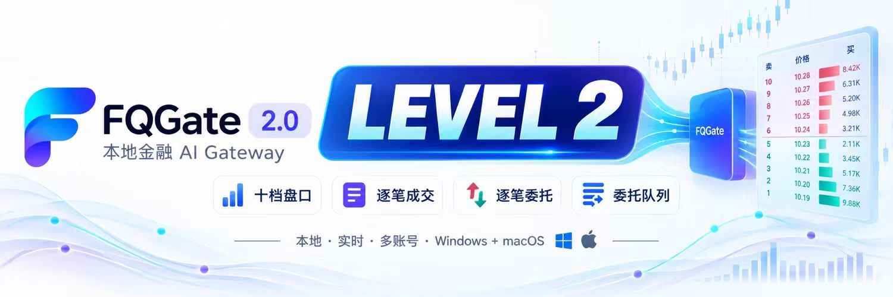

<p align="center">
  
</p>

<h1 align="center">FQGate Agent</h1>

<p align="center">
  面向多种 AI 软件的开源 FQGate 接入层<br>
  让 AI 使用本机 A 股行情、K 线、资讯与 Level-2 数据
</p>

<p align="center">
  <a href="https://github.com/fqgate/FQGate-agent/actions/workflows/ci.yml"></a>
  <a href="https://github.com/fqgate/FQGate-agent/releases"></a>
  <a href="./LICENSE"></a>
  <a href="https://gitee.com/qicuo/tonghuasun-agent"></a>
</p>

<p align="center">
  
</p>


FQGate Agent 是 FQGate 的开源 AI 接入项目，维护 Codex 与 Claude Code 插件入口、四个证券研究 Skill 和 MCP Apps 界面源码。WorkBuddy、ZCode、OpenClaw、DeepSeek Harness、豆包和千问通过 FQGate 主程序的“AI 接入”页面按各自支持条件接入。

> 面向 AI 智能体的金融行情数据 MCP 终端

## 项目入口

| 项目 | 用途 | GitHub | 国内镜像 |
| --- | --- | --- | --- |
| FQGate Agent | 插件、Skill、MCP Apps 源码与 FQGate 正式包 | [fqgate/FQGate-agent](https://github.com/fqgate/FQGate-agent) | [Gitee 源码镜像](https://gitee.com/qicuo/tonghuasun-agent) |
| FQGate 组织 | 项目主页与后续开源项目 | [github.com/fqgate](https://github.com/fqgate) | — |

> **更名说明：** 曾用名 `tonghuasun-codex`、`tonghuasun-agent`，现已更名为 `fqgate-agent`。

Agent 插件入口、Skill 和 MCP Apps 界面源码均免费开源，不设订阅、会员、试用额度或付费解锁。FQGate 主程序作为本机行情网关单独提供编译包，并适用安装包内的许可。

当前 Agent 插件版本为 `1.0.0`，最低需要 FQGate `2.0.0`。FQGate Agent 不提供个人资产、持仓查询、证券买卖、撤单或资金操作。支持自选股管理的数据来源可以查询和修改关注列表，但这不属于证券交易。

## 为什么是 FQGate

- **Level-2：** 提供统一的 Level-2 数据接口，支持逐笔成交、逐笔委托和撤单等实时数据。
- **数据标准：** 不同数据来源通过统一的 V2 接口提供各自支持的行情能力，减少切换来源时的接入差异。
- **实时更新：** 由正在运行的 FQGate 获取行情，并通过查询或实时订阅接口提供给 AI 工具。
- **本机服务：** FQGate 默认只监听 `127.0.0.1:17281`，减少服务暴露范围。
- **统一连接：** 一个 FQGate 实例可以同时服务多个 AI 工具，减少重复登录和重复初始化。
- **当前数据：** 行情与资讯由正在运行的 FQGate 返回，不用模型记忆代替实时查询。
- **研究流程：** 实时行情、条件选股、盘口成交和事件研究分别由对应 Skill 处理。
- **可检查安装：** 正式包提供 SHA-256 文件，接入完成后还需要通过工具列表和真实行情查询确认。

支持 MCP Apps 的 AI 软件可以方便地显示 K 线、证券行情、资讯和 Level-2 成交信息。能否显示相应内容，取决于连接状态、账号权限和数据来源。


## 一句话安装

将下面这句话完整发送给你正在使用的 AI 助手：

```text
请按照 FQGate Agent 仓库说明完成安装和接入：https://github.com/fqgate/FQGate-agent 。先阅读根目录 README；如果电脑上已有 FQGate 0.x 或 1.x，再阅读 docs/升级到-2.x.md。根据操作系统和处理器从 FQGate Agent Releases 选择正式包；Windows 只使用包含完整应用目录的 windows-x64.zip。下载后核对同名 SHA-256 文件，启动 FQGate，在“行情数据”中确认连接可用，再通过“AI 接入”配置当前 AI 软件。最后重新打开 AI 会话，确认名为 fqgate 的 MCP 连接能够返回工具列表并查询一只明确证券的当前行情。任何步骤失败都要说明失败位置和原始错误，不要把仅下载、解压或写入配置表述为安装成功。
```

安装流程应完整覆盖：读取说明、选择匹配系统的正式版本、核对安装包、启动 FQGate、确认数据连接、配置当前 AI 软件，以及使用真实行情查询验证 `fqgate` 连接。

## FQGate 主程序下载

- GitHub 下载：[FQGate Agent Releases](https://github.com/fqgate/FQGate-agent/releases)
- 国内下载：[Gitee FQGate 发行页](https://gitee.com/qicuo/fqgate-releases/releases)

下载时应按操作系统和处理器选择安装包，并使用同名 `.sha256` 文件核对完整性。不要下载 GitHub 自动生成的 Source code 压缩包。

### Windows

下载文件名包含 `windows-x64.zip` 的正式包，完整解压到固定文件夹，再运行其中的 `FQGate.exe`。

- 不要直接在压缩包内运行。
- 不要只移动其中的 `FQGate.exe`，同一目录中的 `fqgate-updater.exe` 用于安装更新。

### macOS

Apple 芯片选择 `macos-arm64.zip`，Intel 芯片选择 `macos-x86_64.zip`。解压后将 `FQGate.app` 移到“应用程序”。

已经安装 FQGate 0.x 或 1.x 的用户，请阅读[升级到 2.x](./docs/升级到-2.x.md)，不要只替换旧版可执行文件。安装结束前，应确认 FQGate 已经启动、数据连接可用，并且名为 `fqgate` 的 MCP 连接能够读取工具列表和查询当前行情。

## 选择你的 AI 工具

| AI 软件                                           | 接入方式                                        |
|-------------------------------------------------|---------------------------------------------|
| ChatGPT（Codex 接入）                               | 在 FQGate“AI 接入”页面安装 Codex 插件，或使用下方 Codex 命令 |
| Claude Code                                     | 在 FQGate“AI 接入”页面安装，或使用下方 Claude Code 命令    |
| 豆包、千问、DeepSeek Harness、WorkBuddy、ZCode、OpenClaw | 开发测试中                                       |

Codex：

```bash
codex plugin marketplace add fqgate/FQGate-agent --json
codex plugin add fqgate-agent@fqgate-official --json
```

Claude Code：

```bash
claude plugin marketplace add fqgate/FQGate-agent --scope user
claude plugin install fqgate-agent@tonghuasun-agent --scope user
```

ChatGPT 入口使用电脑上的 Codex；普通 ChatGPT 网页和手机应用不能通过这个入口连接当前电脑上的 FQGate。完成接入后，需要重新打开 AI 会话。

## 可以直接这样问

- “查看航天机电的 A 股实时行情，并说明主要盘口变化。”
- “显示航天机电最近一个月的日 K 线。”
- “同时对比航天机电、招商银行和宁德时代的行情。”
- “查看这只股票今天的分时、盘口和 Level-2 逐笔数据。”
- “汇总这家公司最近的公告和市场资讯，并标注信息时间。”

普通行情是否可以使用游客连接，取决于当前选择的数据来源。问财和 Level-2 等功能需要相应账号及权限，游客行情可能延迟或受限，最终可用范围以 FQGate 实际返回的工具列表和账号权限为准。


## 数据、隐私与安全

FQGate 默认只监听当前电脑的本机地址，Agent 不会连接公网或局域网中的 FQGate 地址。项目维护者不运营接收用户行情查询、证券账号或 AI 对话内容的远程服务；插件的分析说明和行情图表不会把 FQGate 返回的数据发送给项目维护者。

使用云端 AI 服务时，发送给该服务的对话和工具结果可能受其隐私政策与设置约束。请在使用前阅读[隐私政策](./docs/legal/PRIVACY.md)与[使用条款](./docs/legal/TERMS.md)。

本项目不提供个股推荐、收益预测或投资建议。AI 生成的内容可能存在错误或延迟，行情及证券信息请以数据提供方、证券公司和交易所的正式记录为准。

## 文档与交流

- 本机接口文档：启动 FQGate 后访问 [127.0.0.1:17281/docs](http://127.0.0.1:17281/docs)
- 0.x / 1.x 用户升级说明：[升级到 2.x](./docs/升级到-2.x.md)
- MCP Apps 界面项目：[mcp-apps](./mcp-apps/README.md)
- 隐私、条款与许可边界：[法律文档](./docs/legal/)
- FQGate 官网：[fqgate.github.io](https://fqgate.github.io)
- QQ 群：[免费 AI 量化数据](https://qm.qq.com/q/ZQSuiYQZ4Q)，群号：`14546787`
- 问题反馈：[GitHub Issues](https://github.com/fqgate/FQGate-agent/issues)

微信群二维码会定期失效；当前二维码标注为 2026 年 10 月 17 日前有效。如果下方二维码无法使用，请先加入 QQ 群或提交 Issue 提醒维护者更新。

<p align="center">
  
</p>

## 支持项目

<p align="center">
  <a href="./assets/support/support-banner.png">
    
  </a>
</p>

如果 FQGate 和开源 Agent 项目对你有帮助，欢迎自愿赞赏支持。赞赏不会解锁任何功能、数据权限、投资建议、问题处理优先级或后续服务承诺。

| 头像 | 昵称 | 渠道 | 金额 | 日期 |
| --- | --- | --- | --- | --- |
|  | 峰-Kevin | 微信 |20  | 2026-8-25 |
|  | 阿东 | 微信 |500 |2026-8-27 |
|  | 星光 |微信 |88.88 |2026-8-27 |
|  | 許 |微信 |100 |2026-9-1 |
|  | ICE | 微信 | 8.88 | 2026-9-7 |
|  | 序号 | 微信 | 8.8 | 2026-9-6 |
|  | U_U | 微信 | 188 | 2026-9-7 |
|  | 阿东 | 微信 |100 |2026-9-9 |
|  | wd | 微信 | 100 | 2026-9-9 |
|  | 峰-Kevin | 微信 |50  | 2026-9-9 |
|  | @BetterMe（借钱勿扰） | 微信 | 66 | 2026-9-10 |
|  | 桥南 | 微信| 50 | 2026-9-11|
|  | -45°俯视大地 | 微信 | 5 | 2026-9-12|
|  | **平 | 支付宝 | 50 | 2026-9-14|
|  | 小龙 | 微信 | 88 | 2026-9-19|
|  | 康诚传媒 | 微信 | 5 | 2026-9-23|
|  | 草木皆兵 | 微信 | 5 | 2026-9-24|
|  | **进 | 支付宝| 10 | 2026-9-24 |
|  | 阿东 | 微信 | 188 | 2026-10-3 |
|  | 宏渭 | 微信 | 5 | 2026-10-3 |
|  | 9.59 | 微信 | 50 | 2026-10-5 |


## 开源与许可

Agent 插件入口、Skill 和 MCP Apps 界面源码依据 [AGPL-3.0-only](./LICENSE) 开源。FQGate 编译包适用其随包许可，不属于本仓库的开源范围；详细边界见[法律与许可说明](./docs/legal/)。

这是一个由独立开发者维护的非官方项目，与同花顺及其关联公司不存在授权、合作或背书关系。FQGate 和 Agent 不会增加任何账号的数据权限，实际可用范围仍以相应账号及服务权限为准。
